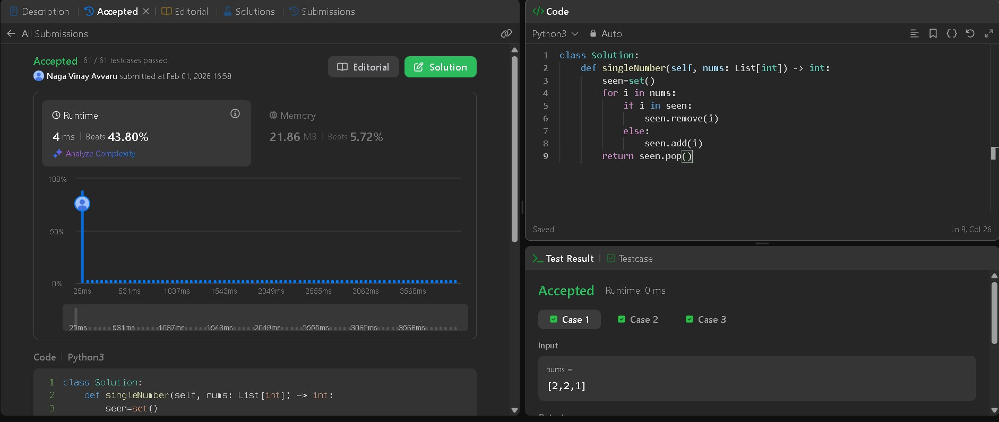
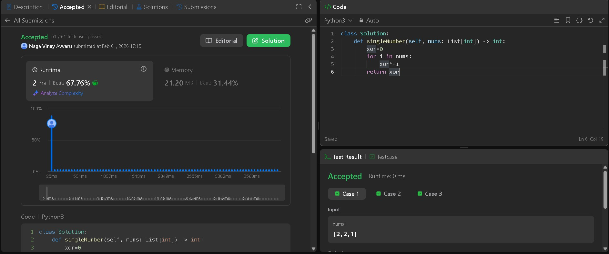

# LeetCode 136 — Single Number

**Problem:**  
Given a non-empty array of integers, every element appears twice except for one. Find that single one.

**LeetCode Link:** <https://leetcode.com/problems/single-number/>  
**Topics:** Array, Bit Manipulation  

---

## First Approach — Array / Set Based

### Code (Arrayapproach.py)

```python
    nums = [2, 2, 1]

    def singleNumber(nums):
        seen = set()
        for i in nums:
            if i in seen:
                seen.remove(i)
            else:
                seen.add(i)
        return seen.pop()

    print(singleNumber(nums))
    print(singleNumber([4, 1, 2, 1, 2]))
    print(singleNumber([1]))
```

### Submission Proof For Approch 1



### Explanation For Approch 1

- Easy to understand logic: add the number the first time, remove it the second time.
- The number that appears only once remains in the set.
- Time Complexity: **O(n)** — single pass through the array.
- Space Complexity: **O(n)** — extra space for the set.
- Works for negative numbers and large values without relying on math tricks.
- Short, readable, and interview-friendly.

---

## Second Approach — Bit Manipulation (XOR)

### Code (Bitmanipulation.py)

```python
nums = [2, 2, 1]

def singleNumber(nums):
    xor = 0
    for i in nums:
        xor ^= i
    return xor

print(singleNumber(nums))
print(singleNumber([4, 1, 2, 1, 2]))
print(singleNumber([1]))
```

### Submission Proof For Approch 2



### Explanation For Approch 2

- Uses **constant extra space** — only one variable (`xor`).
- XOR properties do the heavy lifting:
  - `a ⊕ a = 0`
  - `a ⊕ 0 = a`
- Duplicate numbers cancel each other out.
- The remaining value is the single number.
- Time Complexity: **O(n)** — one clean pass.
- Space Complexity: **O(1)** — optimal and elegant.
- Example: `0 ⊕ 2 ⊕ 2 ⊕ 1 = 1`

---

## Takeaway

Same problem, two mindsets:

- **Set-based approach** → clarity and simplicity.
- **XOR approach** → optimal space and bit-level elegance.

Documenting problems this way forces you to understand *why* a solution works, not just *that* it works — that’s how LeetCode practice actually compounds.
