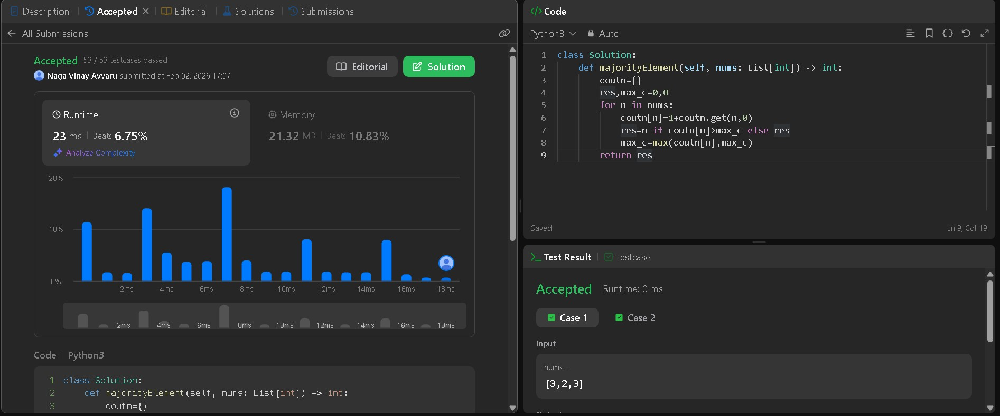
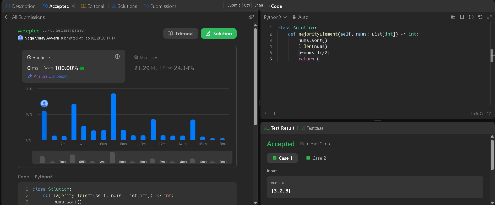
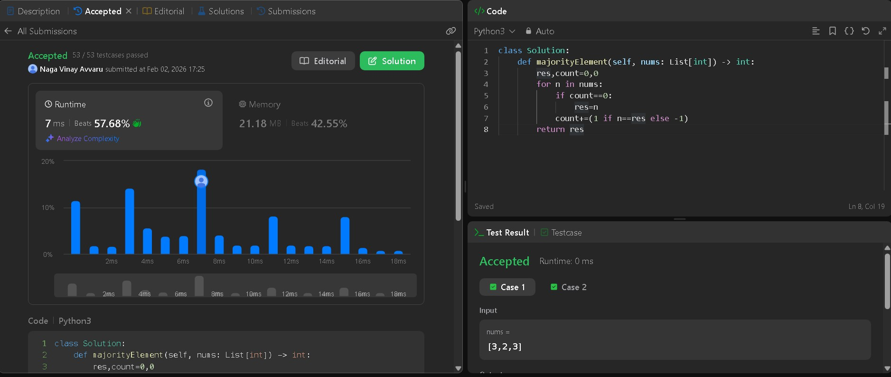

# LeetCode 169 — Majority Element

**Topic:** Arrays, Hashing, Sorting, Boyer–Moore Voting Algorithm  
**Difficulty:** Easy  
**Goal:** Solve the same problem using multiple approaches to deeply understand trade-offs.

---

## 🧠 Problem Statement

Given an array `nums` of size `n`, return the **majority element**.  
The majority element is the element that appears **more than ⌊n / 2⌋ times**.

You may assume that the majority element always exists in the array.

---

## Approach 1: Hash Map (Frequency Counting)

### Code (`array_approach.py`)

```python
nums = [3, 2, 3]

# HashMap solution
def majorityElement(nums):
    count = {}
    res, max_c = 0, 0
    for n in nums:
        count[n] = 1 + count.get(n, 0)
        if count[n] > max_c:
            res = n
            max_c = count[n]
    return res

print(majorityElement(nums))
```

### Submission Proof method 1



### Explanation method 1

We use a dictionary to count how many times each number appears.

Step-by-step:

- nums = [3, 2, 3]
- Frequency map evolves as: `{3:1}`, `{3:1, 2:1}`, `{3:2, 2:1}`
- Track the element with the highest frequency (`max_c`)
- Final answer is `3`

**Time Complexity:** O(n)  
**Space Complexity:** O(n)  

✔️ Easy to understand  
❌ Uses extra memory

---

## Approach 2: Sorting

### Code (`sorting.py`)

```python
nums = [3, 2, 3]

# Sorting solution
def majorityElement(nums):
    nums.sort()
    return nums[len(nums) // 2]

print(majorityElement(nums))
```

### Submission Proof method 2



### Explanation method 2

When the array is sorted, the majority element must occupy the middle index.

Why?

- Majority appears more than n/2 times
- After sorting, it dominates the center

Example:

- nums = [3, 2, 3] → [2, 3, 3]
- Middle index = 1 → value = `3`

**Time Complexity:** O(n log n)  
**Space Complexity:** O(1) (in-place sort)

✔️ Very concise  
❌ Slower due to sorting

---

## Approach 3: Boyer–Moore Voting Algorithm

### Code (`boyer_moore.py`)

```python
nums = [3, 2, 3]

# Boyer-Moore Voting Algorithm
def majorityElement(nums):
    res, count = 0, 0
    for n in nums:
        if count == 0:
            res = n
        count += 1 if n == res else -1
    return res

print(majorityElement(nums))
```

### Submission Proof method 3



### Explanation method 3

This algorithm is based on **pair cancellation**.

Idea:

- Majority element outnumbers all others combined
- Pair every different element with the majority → they cancel out
- Majority survives till the end

Walkthrough:

- 3 → res=3, count=1
- 2 → count=0
- 3 → res=3, count=1

Final candidate = `3`

**Time Complexity:** O(n)  
**Space Complexity:** O(1)  

✔️ Optimal and elegant  
✔️ Interview favorite  
⚠️ Works only when majority is guaranteed

---

## 🧩 Key Takeaways

- Same problem, three mental models
- HashMap → clarity
- Sorting → mathematical guarantee
- Boyer–Moore → algorithmic elegance

This multi-approach practice builds **pattern recognition**, not just solutions.

---

📌 *Documenting problem-solving like this turns practice into proof of thinking.*
