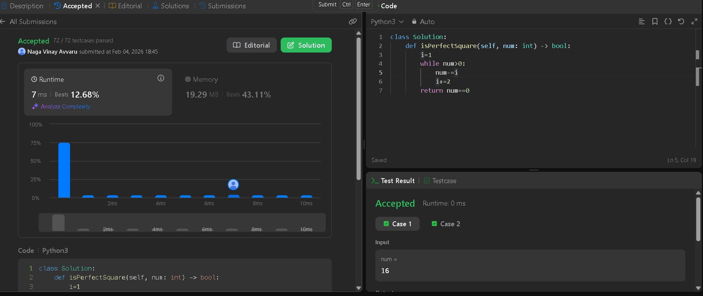
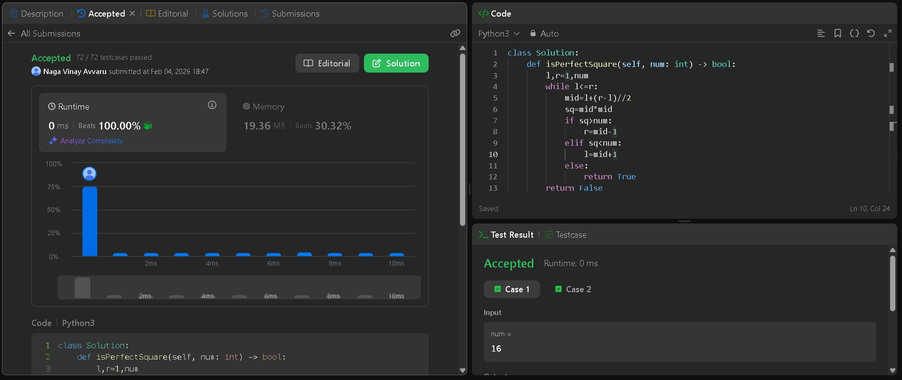

# LeetCode 367: Valid Perfect Square

## Problem Description

Given a positive integer `num`, return `true` if `num` is a **perfect square** (i.e., the square of some integer), or `false` otherwise.

**Constraint:**  
Do **not** use built-in library functions like `sqrt`.

---

## Examples

- **Input:** `num = 16`  
  **Output:** `true`  
  **Explanation:** 4² = 16

- **Input:** `num = 14`  
  **Output:** `false`

---

## Constraints

- 1 ≤ num ≤ 2³¹ − 1

---

## Approach 1: Subtract Odd Numbers (O(√n))

### Idea

A mathematical property:

1 + 3 + 5 + ... + (2k − 1) = k²

Subtract consecutive odd numbers starting from 1.

- Ends at 0 → perfect square  
- Goes negative → not a perfect square

---

### Python Code

```python
def isPerfectSquare(num):
    i = 1
    while num > 0:
        num -= i
        i += 2
    return num == 0

print(isPerfectSquare(14))   # False
print(isPerfectSquare(16))   # True
```

---

### Complexity

- Time: O(√n)
- Space: O(1)

---

### Submission Proof



---

## Approach 2: Binary Search (O(log n))

### Idea approch 2

Binary search in range [1, num] to find `mid` such that:

mid² = num

---

### Python Code approch 2

```python
def isPerfectSquare(num):
    l, r = 1, num
    while l <= r:
        mid = l + (r - l) // 2
        sq = mid * mid
        if sq > num:
            r = mid - 1
        elif sq < num:
            l = mid + 1
        else:
            return True
    return False

print(isPerfectSquare(16))  # True
print(isPerfectSquare(14))  # False
```

---

### Complexity for approch 2

- Time: O(log n)
- Space: O(1)

---

### Submission Proof approch 2


