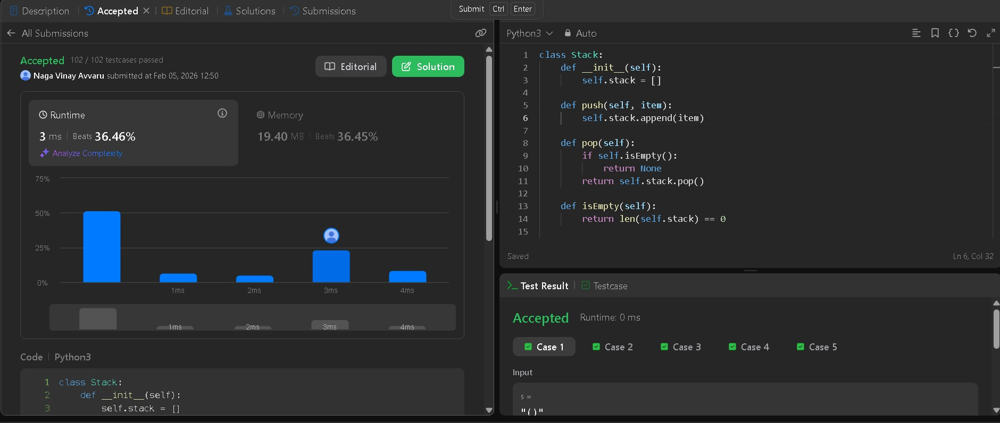
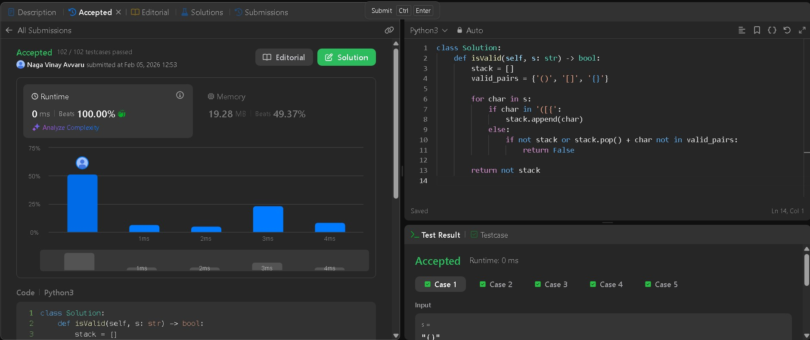

# LeetCode 20. Valid Parentheses

**Problem:**  
Given a non-empty array of integers, every element appears twice except for one. Find that single one.

**LeetCode Link:** <https://leetcode.com/problems/valid-parentheses/>  
**Topics:** String, Stack

---

## First Approach — String

### Code

```python
    class Solution:
    def isValid(self, s: str) -> bool:
        stack = []
        valid_pairs = {'()', '[]', '{}'}
        
        for char in s:
            if char in '([{':
                stack.append(char)
            else:
                if not stack or stack.pop() + char not in valid_pairs:
                    return False
        
        return not stack
```

### Submission Proof For Approch 1



### Explanation For Approch 1

How it works:

- Push ( { [ onto custom Stack
- For ) } ]: Check if stack empty → peek matches → pop only if perfect pair

Step by step:

- See opening bracket → push
- See closing → peek top + check if matches → pop if yes, else fail
- End → empty stack = valid ✅
- Easy check: Uses many if-elif for each bracket pair

---

## Second Approach — Stack

### Code(Stack.py)

```python
class Stack:
    def __init__(self):
        self.stack = []
    
    def push(self, item):
        self.stack.append(item)
    
    def pop(self):
        if self.isEmpty():
            return None
        return self.stack.pop()
    
    def isEmpty(self):
        return len(self.stack) == 0
    
    def peek(self):
        return self.stack[-1] if self.stack else None

class Solution:
    def isValid(self, s: str) -> bool:
        stack=Stack()
    
        for i in s:
            if i=='(' or i=='{' or i=='[':
                stack.push(i)
            else:
                if stack.isEmpty():
                    return False
                if i==')' and stack.peek()=='(':
                    stack.pop()
                elif i=='}' and stack.peek()=='{':
                    stack.pop()
                
                elif i==']' and stack.peek()=='[':
                    stack.pop()
                else:
                    return False    
        
        return stack.isEmpty()
```

### Submission Proof For Approch 2



### Explanation For Approch 2

1.How it works:

- Use simple list [] + set of valid pairs {'()', '[]', '{}'}
- Push openings, pop + combine with closing → check if in set

2.Step by step:

- Opening → stack.append('(')
- Closing → popped+'char' like '('+')' → check set → fail if not match
- End → not stack (empty = True ✅)

---

## Takeaway

Same problem, two mindsets:

- **Set-based approach** → clarity and simplicity.
- **XOR approach** → optimal space and bit-level elegance.

Documenting problems this way forces you to understand *why* a solution works, not just *that* it works — that’s how LeetCode practice actually compounds.
