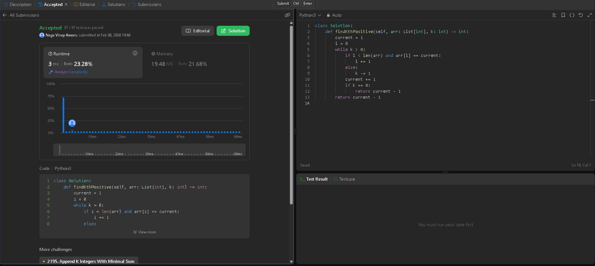
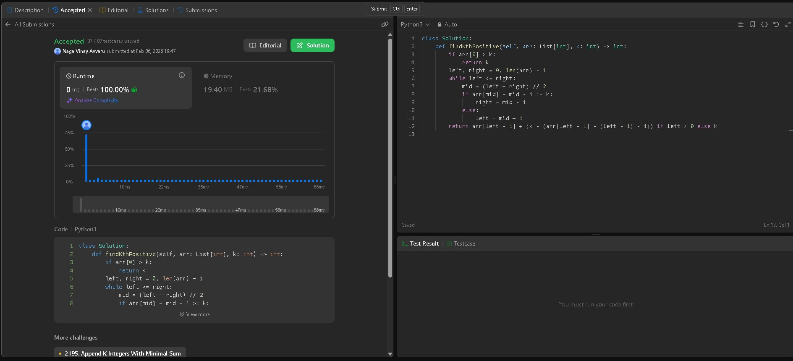

# LeetCode 1539 — Kth Missing Positive Number

**Problem Statement:**  
Given an array `arr` of positive integers sorted in a strictly increasing order, and an integer `k`, return the **kth positive integer that is missing** from this array.

**LeetCode Link:** [Kth Missing Positive Number — LeetCode 1539](https://leetcode.com/problems/kth-missing-positive-number/)  
**Topics:** Array, Binary Search  

---

## Approach 1 — Array Method (Linear Scan)

### Code (ArrayApproach.py)

```python
from typing import List

class Solution:
    def findKthPositive(self, arr: List[int], k: int) -> int:
        current = 1
        i = 0
        while k > 0:
            if i < len(arr) and arr[i] == current:
                i += 1
            else:
                k -= 1
            current += 1
            if k == 0:
                return current - 1
        return current - 1
```

### Submission Proof



### Explanation

This method simulates counting positive numbers starting from `1`.

- Iterate through expected natural numbers.
- If the number exists in the array, move the pointer.
- If it is missing, decrement `k`.
- When `k` becomes zero, the current number is the answer.

**Time Complexity:** O(n + k)  
**Space Complexity:** O(1)

---

## Approach 2 — Binary Search (Optimized)

### Code (BinarySearch.py)

```python
from typing import List

class Solution:
    def findKthPositive(self, arr: List[int], k: int) -> int:
        if arr[0] > k:
            return k

        left, right = 0, len(arr) - 1
        while left <= right:
            mid = (left + right) // 2
            missing = arr[mid] - mid - 1

            if missing >= k:
                right = mid - 1
            else:
                left = mid + 1

        missing_before = arr[left - 1] - (left - 1) - 1
        return arr[left - 1] + (k - missing_before)
```

### Submission Proof 2



### Explanation 2

The number of missing positives before index `i` is:

```(python)

missing = arr[i] - i - 1
```

This value grows monotonically, enabling binary search.

After locating the boundary:

- The kth missing number lies after `arr[left - 1]`.
- Add the remaining difference to compute the answer.

**Time Complexity:** O(log n)  
**Space Complexity:** O(1)

---

## Takeaway

- Linear scan → simple and intuitive.
- Binary search → efficient and scalable.

Understanding both turns a solution into mastery.
