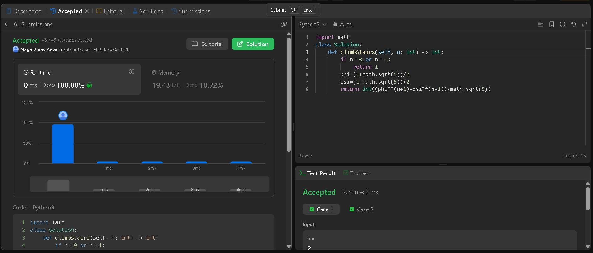
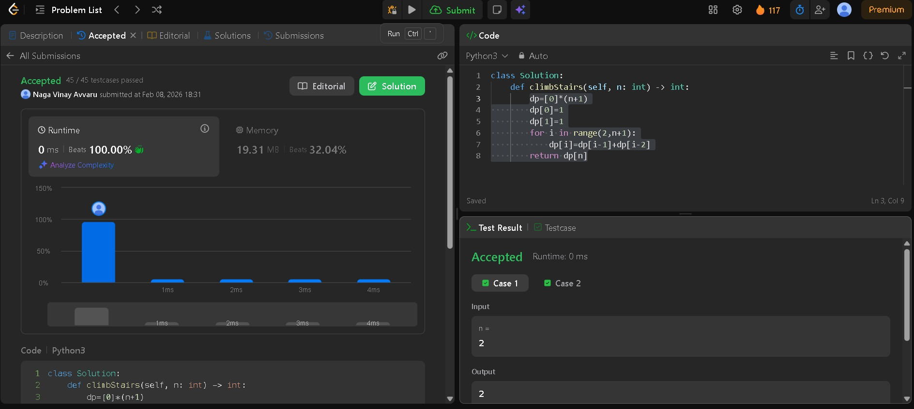

# LeetCode 70 — Climbing Stairs

**Problem Statement:**  
You are climbing a staircase. It takes `n` steps to reach the top. Each time you can climb `1` or `2` steps. In how many distinct ways can you climb to the top?

**LeetCode Link:** [Climbing Stairs — LeetCode 70](https://leetcode.com/problems/climbing-stairs/)  
**Topics:** Dynamic Programming, Math, Memoization  

---

## Approach 1 — Dynamic Programming (DP)

### Code (ClimbingStairs(DP).py)

```python
def climb_stairs_dp(n):
    dp = [0] * (n + 1)
    dp[0] = 1
    dp[1] = 1
    for i in range(2, n + 1):
        dp[i] = dp[i - 1] + dp[i - 2]
    return dp[n]

test_cases_dp = [2, 3, 4, 5]
print("DP Approach Tests:")
for n in test_cases_dp:
    print(f"n={n}: {climb_stairs_dp(n)}")
```

### Submission Proof



### Explanation

The Dynamic Programming approach uses a table to store previously computed results.

**How it works:**

- Create an array `dp` where `dp[i]` represents the number of ways to reach step `i`.
- Base cases: `dp[0] = 1` (one way to stay at ground), `dp[1] = 1` (one way to reach step 1).
- For each step `i` from 2 to `n`, we can reach it from either step `i-1` (with 1 step) or step `i-2` (with 2 steps).
- Therefore, `dp[i] = dp[i-1] + dp[i-2]` (similar to Fibonacci).
- Return `dp[n]` for the final answer.

**Time Complexity:** O(n)  
**Space Complexity:** O(n)

---

## Approach 2 — Memoization (Recursive with Cache)

### Code (ClimbingStairs(Memoization).py)

```python
def climbStairs(self, n: int) -> int:
    memo = {}
    def helper(i: int) -> int:
        if i <= 1:
            return 1
        if i in memo:
            return memo[i]
        memo[i] = helper(i - 1) + helper(i - 2)
        return memo[i]
    return helper(n)

# Test cases
test_cases_memo = [2, 3, 4, 5]
print("Memoization Approach Tests:")
for n in test_cases_memo:
    print(f"n={n}: {climbStairs(n)}")
```

### Submission Proof



### Explanation

Memoization uses top-down recursion with caching to avoid redundant calculations.

**How it works:**

- Use a helper recursive function that computes the number of ways to reach step `i`.
- Base case: if `i <= 1`, return 1.
- Check if the result for `i` is already in the memo dictionary; if yes, return it.
- Otherwise, compute `memo[i] = helper(i-1) + helper(i-2)` and cache it.
- Return the cached result.
- This avoids recalculating the same subproblems multiple times.

**Time Complexity:** O(n)  
**Space Complexity:** O(n) (for the memo dictionary and recursion stack)

---

## Approach 3 — Mathematical Formula (Fibonacci Formula)

### Code (ClimbingStairs(math).py)

```python
import math

def climbStairs(n):
    if n == 0 or n == 1:
        return 1
    phi = (1 + math.sqrt(5)) / 2
    psi = (1 - math.sqrt(5)) / 2
    return int((phi ** (n + 1) - psi ** (n + 1)) / math.sqrt(5))

test_cases_math = [2, 3, 4, 5]
print("Math Approach Tests:")
for n in test_cases_math:
    print(f"n={n}: {climbStairs(n)}")
```

### Submission Proof


### Explanation

The Mathematical approach uses Binet's Formula, which is the closed-form solution for Fibonacci numbers.

**How it works:**

- The climbing stairs problem follows the Fibonacci sequence: F(n) = F(n-1) + F(n-2).
- Binet's formula: F(n) = (φ^(n+1) - ψ^(n+1)) / √5
  - φ (phi) = (1 + √5) / 2 ≈ 1.618 (the golden ratio)
  - ψ (psi) = (1 - √5) / 2 ≈ -0.618
- This formula directly calculates the nth Fibonacci number without iteration or recursion.
- Convert the result to an integer since floating-point precision may cause minor deviations.

**Time Complexity:** O(1)  
**Space Complexity:** O(1)

---

## Comparison of Approaches

| Approach | Time Complexity | Space Complexity | Pros | Cons |
|----------|-----------------|------------------|------|------|
| DP | O(n) | O(n) | Simple, easy to understand | Requires extra space |
| Memoization | O(n) | O(n) | Flexible, can handle variations | Recursion stack overhead |
| Math Formula | O(1) | O(1) | Fastest, minimal space | Floating-point precision issues, less intuitive |

---

## Example Walkthrough

**Input:** n = 3  
**Output:** 3

**Explanation:**  
There are 3 ways to climb to the top:
1. 1 step + 1 step + 1 step
2. 1 step + 2 steps
3. 2 steps + 1 step

**Using DP Approach:**
- dp[0] = 1
- dp[1] = 1
- dp[2] = dp[1] + dp[0] = 1 + 1 = 2
- dp[3] = dp[2] + dp[1] = 2 + 1 = 3 ✅
