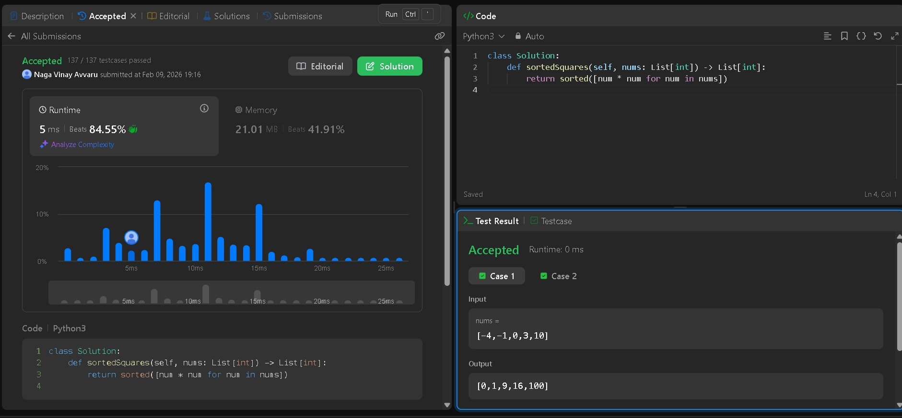
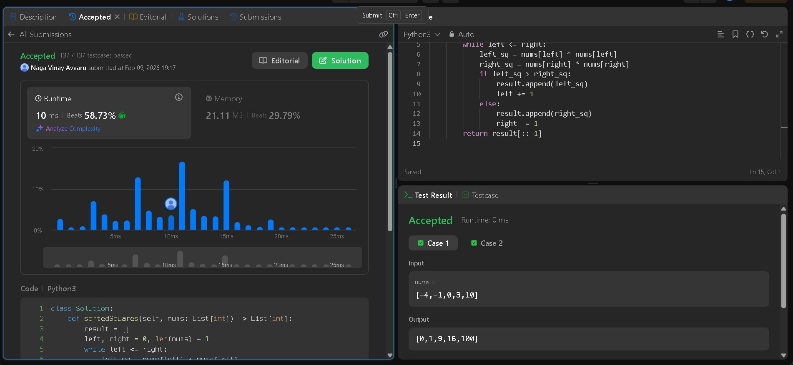
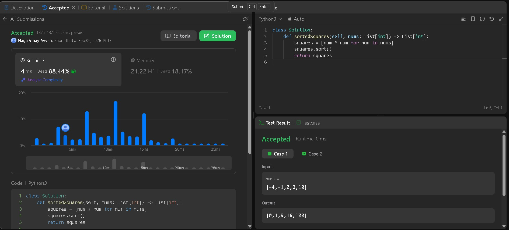

# LeetCode 977 — Squares of a Sorted Array

**Problem Statement:**  
Given an integer array `nums` sorted in non-decreasing order, return an array of the squares of each number sorted in non-decreasing order.

**LeetCode Link:** [Squares of a Sorted Array — LeetCode 977](https://leetcode.com/problems/squares-of-a-sorted-array/)  
**Topics:** Array, Two Pointers, Sorting

---

## Approach 1 — Simple Array / List Comprehension + Sort

### Code (SquareOfSortedArray(array).py)

```python
nums_1=[-4,-1,0,3,10]
nums_2= [-7,-3,2,3,11]
def sortedSquares(nums):
    
	return sorted([num * num for num in nums])


print(sortedSquares(nums_1))
print(sortedSquares(nums_2))
```

### Submission Proof



### Explanation

- Square every element using a list comprehension, then sort the resulting list.
- Time Complexity: **O(n log n)** due to sorting.
- Space Complexity: **O(n)** for the new list of squares.

---

## Approach 2 — Square Then In-Place Sort

### Code (SquareOfSortedArray(Sorted).py)

```python
nums_1=[-4,-1,0,3,10]
nums_2= [-7,-3,2,3,11]
def sortedSquares(nums):
	squares = [num * num for num in nums]
	squares.sort()
	return squares


print(sortedSquares(nums_1))
print(sortedSquares(nums_2))

#
```

### Submission Proof



### Explanation

- Compute all squares, then sort them in-place.
- Time Complexity: **O(n log n)**.
- Space Complexity: **O(n)**.

---

## Approach 3 — Two Pointers (Optimal O(n))

### Code (SquareOfSortedArray(Twopointers).py)

```python
nums_1=[-4,-1,0,3,10]
nums_2= [-7,-3,2,3,11]
def sortedSquares(nums):
	result = []
	left, right = 0, len(nums) - 1
	while left <= right:
		left_sq = nums[left] * nums[left]
		right_sq = nums[right] * nums[right]
		if left_sq > right_sq:
			result.append(left_sq)
			left += 1
		else:
			result.append(right_sq)
			right -= 1
	return result[::-1]


print(sortedSquares(nums_1))
print(sortedSquares(nums_2))
```

### Submission Proof



### Explanation

- Use two pointers at both ends of the sorted input array; larger absolute values are at the ends.
- Compare squares at `left` and `right`, append the larger to the `result` list, and move that pointer inward.
- Since we append largest-first, reverse the final list before returning.
- Time Complexity: **O(n)** — single pass.
- Space Complexity: **O(n)** for the output list.

---

## Comparison

| Approach | Time Complexity | Space Complexity | Pros | Cons |
|----------|-----------------|------------------|------|------|
| List comprehension + sort | O(n log n) | O(n) | Simple, concise | Slower due to sort |
| Square then sort | O(n log n) | O(n) | Explicit steps, easy to reason | Slower due to sort |
| Two Pointers | O(n) | O(n) | Optimal time, no extra sort | Slightly more logic to implement |

---

## Example

Input: `nums = [-4,-1,0,3,10]`  
Output: `[0,1,9,16,100]`  

Explanation (Two Pointers):

- Compare -4 and 10 → 16 vs 100 → append 100
- Compare -4 and 3 → 16 vs 9 → append 16
- Continue until all elements handled, then reverse result → `[0,1,9,16,100]`

---

## Notes

- Use the two-pointers approach for optimal performance on large inputs.
- Submission images (Submission1.jpg, Submission2.jpg, Submission3.jpg) can be added to this folder.

